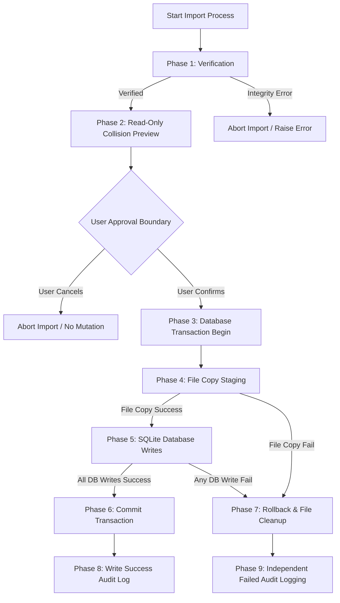

# Archive Import Transaction Sequence Design — Task 059R

> [!NOTE]  
> **Design-only document.** No database migrations, SQL modifications, or production write integrations are executed in this batch.

---

## 1. Purpose

This document designs the transactional boundary, sequence of operations, rollback requirements, and audit logging boundaries for importing a strategy archive into a workspace. It clarifies the execution flow spanning both SQLite database writes and filesystem mutations.

---

## 2. Complete Transaction Sequence Flowchart

The importing flow is split into a **Read-Only / Safe Phase** and a **Write / Transactional Phase**, separated by a **User Approval Boundary**.

---

## 3. Step-by-Step Sequence Phases

### Phase 1: Verification (Implemented)
- **Action**: Check schema major version compatibility and delegate to `ArchiveVerifier.verify_all()`.
- **Status**: **Fully Implemented** (`ArchiveImporter.verify()`).

### Phase 2: Read-Only Collision Preview (Implemented)
- **Action**: Read the JSON files (`strategy.json`, `dataset_meta.json`, `validation_result.json`) and extract DTOs. Invoke collision detector queries against SQLite to check strategy and dataset conflicts.
- **Status**: **Fully Implemented** (`ArchiveImporter.build_preview()`).

---

### User Approval Boundary (Future GUI / Service Wiring)
- **Action**: The UI displays the collision status and summary preview (dry-run summary) to the user. The import does not proceed unless the user explicitly clicks "Confirm Import".
- **Status**: **Future Implementation** (UX/Service Layer).

---

### Phase 3: Database Transaction Begin (Future Implementation)
- **Action**: Open a database transaction (`BEGIN TRANSACTION`) on the workspace SQLite connection.
- **Status**: **Future Implementation**.

### Phase 4: File Copy Staging (Future Implementation)
- **Action**: Copy the CSV snapshot file to the application's local directory (`data/normalized/`). 
- **Staging Rule**: The copy operation must happen *before* committing the DB transaction. If the copy fails (e.g. disk space, write permissions), raise `SnapshotWriteError` and skip to Phase 7.
- **Status**: **Future Implementation**.

### Phase 5: SQLite Database Writes (Future Implementation)
- **Action**: Write Strategy definition, Dataset metadata, and Validation results inside the SQLite transaction. If any database write fails (e.g., integrity constraint violation), raise `RepositoryWriteError` and skip to Phase 7.
- **Status**: **Future Implementation**.

### Phase 6: Commit Transaction (Future Implementation)
- **Action**: Issue `COMMIT` on the SQLite database connection to finalize all row insertions.
- **Status**: **Future Implementation**.

### Phase 7: Rollback & File Cleanup (Future Implementation)
- **Action**:
  1. Revert database changes by issuing `ROLLBACK` on the SQLite database connection.
  2. Revert filesystem changes by unlinking/deleting the copied CSV file from Phase 4 if it was written.
- **Status**: **Future Implementation**.

### Phase 8: Write Success Audit Log (Future Implementation)
- **Action**: Log a successful entry in the SQLite `ImportAuditLog` table.
- **Status**: **Future Implementation**.

### Phase 9: Independent Failed Audit Logging (Future Implementation)
- **Action**: Open an independent transaction or a separate SQLite connection to write a failed entry in the `ImportAuditLog` table with the detailed error message. This logs the telemetry without polluting the main database tables.
- **Status**: **Future Implementation**.

---

## 4. Recommended Next Two-Task Batch

**Batch 059S-Design + 059T-Design - ImportAuditLog Migration Plan and Repository Adapter Test Contract Design**
- **059S-Design**: Design the SQLite database schema migration plan for the `ImportAuditLog` table and define the required schema changes, without executing the migration.
- **059T-Design**: Design the repository adapter test contracts (including mock and spy behavior verification), rollback acceptance criteria, and edge-case error scenarios, without implementing DB writes or CLI/UI/service orchestration.
